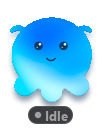
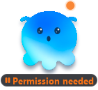
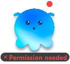
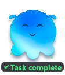
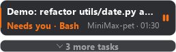
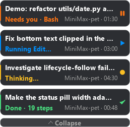

<div align="center">

# MiniMax Pet

**A bilingual desktop pet that lives on your taskbar and tells you what MiniMax Code is doing — without you ever alt-tabbing.**

[English](README.md) · [简体中文](README.zh-CN.md)

[](LICENSE)
[](https://www.python.org/)
[](https://pypi.org/project/PyQt5/)
[]()

</div>

---

## What is this?

MiniMax Pet is a small always-on-top mascot that tails MiniMax Code's session
transcripts and renders your tasks as live cards. You submit a prompt, walk
away, and the pet tells you when it is thinking, when it is running a tool,
when **it needs your permission**, and when it is **done**.

It never guesses. Every state it shows is derived from the actual
`messages.jsonl` that MiniMax Code writes.

| Idle | Thinking | Running |
|:---:|:---:|:---:|
|  |  |  |

| Needs you | Failed | Done |
|:---:|:---:|:---:|
|  |  |  |

| Cards collapsed | Cards expanded |
|:---:|:---:|
|  |  |

<sub>Screenshots are generated by the built-in `--selftest` renderer, so they can never drift from the code.</sub>

---

## Highlights

- **Read-only by design.** The pet only *reads* `~/.minimax/v2/sessions/**/messages.jsonl`.
  It never writes into MiniMax Code's config or session directories. Its own
  state stays inside the project folder.
- **Noise-filtered task titles.** User messages contain harness-injected
  `<system-reminder>` blocks. The pet slices out the real prompt using the
  message's own `canonicalTextRange`, and skips the message entirely when
  nothing real is left — so an injected reminder never becomes your task title
  or resets your step count.
- **Multi-session cards.** Every live session gets its own card. They never
  overwrite each other, and clicking a card jumps straight to that session in
  MiniMax Code.
- **Permission nudges.** A tool call that goes out but gets no result back is
  treated as *Needs you* — an orange pulse, so a blocked agent never sits
  silent.
- **Compaction-aware.** Sessions whose first message is a `compactionSummary`
  get a sensible title pulled out of the summary text.
- **Full bilingual UI (中文 / English).** Every pixel of user-facing text goes
  through one string table. Switch live from the tray menu — no restart.
- **App lifecycle follow.** The pet appears when MiniMax Code starts and hides
  when it exits. Optional: tick *Exit pet when MiniMax exits* to have the pet
  quit too.
- **A local HTTP event bridge.** Any script can push a task onto the pet.
- **Self-testing renderer.** `--selftest` renders every state offscreen to
  `docs/images/`, which is exactly how the screenshots above are produced.

---

## Requirements

- **Python 3.9+**
- **PyQt5**
- MiniMax Code installed (for live tracking). Without it you can still run
  `--demo` to see the pet in action.

```bash
pip install PyQt5
```

---

## Quick start

```bash
git clone https://github.com/Hai-mian-33/MiniMax-pet.git
cd MiniMax-pet
pip install PyQt5
python minimax_pet.py
```

Or on Windows, double-click **`scripts\run_pet.bat`**.

Nothing else to configure. If MiniMax Code is running, the pet starts
tracking immediately.

### Try it without a real task

```bash
python minimax_pet.py --demo
```

This plays one synthetic task from thinking → running → needs-you → done, so
you can see the whole visual vocabulary in about 40 seconds.

---

## The bilingual system

The pet ships with complete Chinese and English interfaces. All user-facing
strings live in a single table, [`i18n.py`](i18n.py) — no hardcoded text in
the UI code.

**Switch at runtime:** right-click the pet (or the tray icon) →
**语言 / Language** → `中文` / `English`. The change applies immediately and is
remembered in `pet_state.json`.

**Set it at launch:**

```bash
python minimax_pet.py --lang zh
python minimax_pet.py --lang en
```

**Resolution order** (highest wins):

1. `--lang` on the command line
2. the language saved in `pet_state.json`
3. system language (`MINIMAX_PET_LANG`, `LC_ALL`, `LC_MESSAGES`, `LANG`)
4. Chinese

### Adding a third language

1. Add the code to `LANGS` in `i18n.py`.
2. Copy the `"zh"` dict to a new `LANG` key and translate it.
3. Extend `normalize()` so it recognises your locale.

There is no other wiring to do — the tray menu and `--lang` choices are both
derived from `LANGS`.

### Adding a new string

```python
# i18n.py
"toast.finished": "干完了",                              # zh
"toast.finished": ("All wrapped up", ...),                # en

# anywhere in minimax_pet.py
toast(t("toast.finished"))
```

A string value may also be a `[singular, plural]` pair. The first integer
argument picks the form:

```python
t("card.done", steps)        # → "Done · 1 step"  /  "Done · 19 steps"
```

Unknown keys fall back to Chinese, then to the key itself — the UI degrades,
it never crashes.

---

## Command line

| Flag | Meaning |
|---|---|
| `--lang {zh,en}` | Force the interface language |
| `--demo` | Play one synthetic task on start |
| `--selftest` | Render every state offscreen to `docs/images/`, then exit |
| `--selftest-scale N` | Render the selftest at N× zoom (for inspecting pixels) |
| `--selftest-live` | Run the selftest against your *real* sessions |
| `--port N` | Event port (default `8766`) |
| `--no-follow` | Do not hide/show with MiniMax Code |
| `--exit-with-app` | Quit the pet when MiniMax Code quits |
| `--no-server` | Disable the local HTTP event bridge |

---

## HTTP event bridge

The pet listens on `127.0.0.1:8766` (ports `8766`–`8776` if taken).

```bash
curl -X POST http://127.0.0.1:8766/event \
  -H "Content-Type: application/json" \
  -d '{"state":"executing","task":"Deploy the release","steps":12}'
```

Recognised fields: `state` (`idle` / `thinking` / `executing` / `waiting` /
`done` / `error`), `task`, `project`, `steps`, `errors`, `tool`, `notify`.

Health check:

```bash
curl http://127.0.0.1:8766/
# MiniMax Pet ok  app_running=True
```

Disable it entirely with `--no-server`.

---

## Regenerating the screenshots

```bash
python minimax_pet.py --lang zh --selftest    # writes docs/images/*-zh.png
python minimax_pet.py --lang en --selftest    # writes docs/images/*-en.png
```

Every screenshot is paired by language, so the README can show both.

---

## Autostart

```bash
python autostart.py install     # copy autostart.py into your startup folder
python autostart.py uninstall   # remove it again
```

Or use the batch wrappers in `scripts/`.

---

## Project layout

```
MiniMax-pet/
├── minimax_pet.py            # the whole pet: watcher, widgets, tray, HTTP bridge
├── i18n.py                   # zh / en string tables — the single source of truth
├── autostart.py              # register / unregister autostart
├── pet_launcher.py           # thin wrapper used by the startup entry
├── build_assets.py           # regenerate assets/ from the official mascot
├── assets/                   # mascot.png, mascot_glow.png, mascot_shadow.png, mascot_tray.png
├── docs/
│   ├── images/               # bilingual screenshots (*-zh.png / *-en.png)
│   ├── UPLOAD-GITHUB.md
│   └── UPLOAD-GITHUB.zh-CN.md
├── scripts/                  # .bat wrappers for Windows users
├── tests/                    # run_tests.py — syntax, i18n, plural, renderer
└── README.md / README.zh-CN.md / CONTRIBUTING.md / LICENSE / .gitignore
```

---

## How it tracks your tasks

```
~/.minimax/v2/sessions/<Y>/<M>/<D>/<session>/messages.jsonl
        │
        │  tail -f, offset-tracked, partial-line safe
        ▼
   SessionWatcher._apply()
        │
        ├─ user         (real prompt only)  → thinking
        ├─ assistant    toolCall             → executing  (+ tool name)
        ├─ assistant    text                 → done       (+ step count, frozen duration)
        ├─ toolResult   isError              → error      (or executing)
        └─ tool call with no result (45 s)   → waiting    (needs you)
        │
        ▼
   CardStack  ──►  click a card  ──►  jump to that session in MiniMax Code
```

## Contributing

See [CONTRIBUTING.md](CONTRIBUTING.md). Bug reports and pull requests are very
welcome — especially new translations.

---

## License

[MIT](LICENSE) © 2026 Haiming Sun

The mascot artwork in `assets/` is derived from the official MiniMax Code
`icon.icns` and remains the property of its respective owner. It is included
here for personal, non-commercial desktop-pet use.
