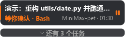
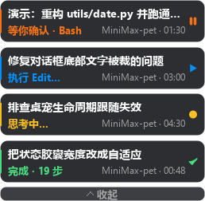

<div align="center">

# MiniMax Pet

**一只住在任务栏上的双语桌宠，不用切窗口就知道 MiniMax Code 正在干什么。**

[English](README.md) · [简体中文](README.zh-CN.md)

[](LICENSE)
[](https://www.python.org/)
[](https://pypi.org/project/PyQt5/)
[]()

</div>

---

## 这是什么？

MiniMax Pet 是一只常驻置顶的小吉祥物，它会实时读取 MiniMax Code 的会话转录，
把你的任务渲染成一张张活着的卡片。你丢下一个需求就去忙别的，它负责告诉你：
**在想、在跑、在等你点确认、还是干完了。**

它不猜。所有状态都是从 MiniMax Code 真实写入的 `messages.jsonl` 里推导出来的。

| 待命 | 思考中 | 执行中 |
|:---:|:---:|:---:|
|  |  |  |

| 等你确认 | 出错 | 完成 |
|:---:|:---:|:---:|
|  |  |  |

| 折叠态 | 展开态 |
|:---:|:---:|
|  |  |

<sub>所有截图都由内置的 `--selftest` 渲染器生成，因此永远不会和代码脱节。</sub>

---

## 特性

- **只读，不越界。** 桌宠只**读** `~/.minimax/v2/sessions/**/messages.jsonl`，
  从不写入 MiniMax Code 的配置或会话目录；它自己的状态也只落在本项目目录内。
- **任务标题不会被噪声污染。** user 消息里混着 harness 注入的 `<system-reminder>`。
  桌宠用消息自带的 `canonicalTextRange` 精确切出真实提问；切不出内容就整条跳过，
  **不**把注入内容当成任务标题，也**不**因此重置步数。
- **多会话各自成卡。** 每个活跃会话一张卡，互不覆盖。点卡片可直接跳到对应会话。
- **卡住会喊你。** 工具已发出却迟迟没有回结果 → 判定为「等你确认」，橙色呼吸提醒，
  Agent 不会一声不吭地卡在那儿。
- **懂上下文压缩。** 首条是 `compactionSummary` 的会话，会从回顾正文里提炼出像样的标题。
- **完整中英双语界面。** 所有面向用户的文字都走同一张词表，托盘菜单里随时切换，**不用重启**。
- **跟随应用生命周期。** MiniMax Code 起来就显示，退出就隐藏；也可勾选「一并退出」。
- **本地 HTTP 事件入口。** 任何脚本都能往桌宠上推任务。
- **自带截图渲染器。** `--selftest` 离屏渲染全部状态到 `docs/images/`，
  上面的截图就是这么来的。

---

## 环境要求

- **Python 3.9+**
- **PyQt5**
- 已安装 MiniMax Code（用于真实追踪；没有也能用 `--demo` 看效果）

```bash
pip install PyQt5
```

---

## 快速开始

```bash
git clone https://github.com/Hai-mian-33/MiniMax-pet.git
cd MiniMax-pet
pip install PyQt5
python minimax_pet.py
```

Windows 用户也可以直接双击 **`scripts\run_pet.bat`**。

无需任何额外配置。只要 MiniMax Code 在跑，桌宠立刻开始追踪。

### 先看看效果

```bash
python minimax_pet.py --demo
```

会演一遍合成任务：思考中 → 执行中 → 等你确认 → 完成，约 40 秒看完整套视觉语言。

---

## 双语系统

桌宠内置完整的中文 / 英文界面。所有面向用户的字符串都在
[`i18n.py`](i18n.py) 这一张表里，UI 代码里不硬编码任何文案。

**运行时切换：** 右键桌宠（或托盘图标）→ **语言 / Language** → `中文` / `English`。
立即生效，并记住在 `pet_state.json` 里。

**启动时指定：**

```bash
python minimax_pet.py --lang zh
python minimax_pet.py --lang en
```

**优先级（从高到低）：**

1. 命令行 `--lang`
2. `pet_state.json` 里记住的上次选择
3. 系统语言（`MINIMAX_PET_LANG` / `LC_ALL` / `LC_MESSAGES` / `LANG`）
4. 中文

### 加第三种语言

1. 把语言代码加进 `i18n.py` 的 `LANGS`；
2. 复制 `"zh"` 那一整个 dict，改成新语言并翻译；
3. 在 `normalize()` 里让它认得你的地区写法。

托盘菜单和 `--lang` 选项都是从 `LANGS` 派生的，不用改别的地方。

### 加一条新文案

```python
# i18n.py
"toast.finished": "干完了",            # zh
"toast.finished": "All wrapped up",   # en

# minimax_pet.py 任意位置
toast(t("toast.finished"))
```

词表的值也可以写成 `[单数, 复数]`，由第一个整数参数决定用哪个：

```python
t("card.done", steps)     # → "完成 · 1 步"  /  "Done · 1 step" / "Done · 19 steps"
```

查不到 key 时先回退中文表，再回退到 key 本身——界面只会退化，不会崩。

---

## 命令行参数

| 参数 | 含义 |
|---|---|
| `--lang {zh,en}` | 强制指定界面语言 |
| `--demo` | 启动后演示一轮任务 |
| `--selftest` | 离屏渲染全部状态到 `docs/images/` 后退出 |
| `--selftest-scale N` | 自检按 N 倍放大渲染（用来看细节） |
| `--selftest-live` | 自检时读取**真实**会话 |
| `--port N` | 事件端口（默认 `8766`） |
| `--no-follow` | 不跟随 MiniMax Code 显示 / 隐藏 |
| `--exit-with-app` | MiniMax Code 退出时桌宠一并退出 |
| `--no-server` | 关闭本地 HTTP 事件入口 |

---

## HTTP 事件入口

桌宠监听 `127.0.0.1:8766`（被占用时依次尝试 `8766`–`8776`）。

```bash
curl -X POST http://127.0.0.1:8766/event \
  -H "Content-Type: application/json" \
  -d '{"state":"executing","task":"发布新版本","steps":12}'
```

可用字段：`state`（`idle` / `thinking` / `executing` / `waiting` / `done` / `error`）、
`task`、`project`、`steps`、`errors`、`tool`、`notify`。

健康检查：

```bash
curl http://127.0.0.1:8766/
# MiniMax Pet ok  app_running=True
```

用 `--no-server` 可以完全关掉。

---

## 重新生成截图

```bash
python minimax_pet.py --lang zh --selftest    # 生成 docs/images/*-zh.png
python minimax_pet.py --lang en --selftest    # 生成 docs/images/*-en.png
```

截图按语言成对存放，README 里直接对照展示。

---

## 开机自启

```bash
python autostart.py install     # 注册到开机启动项
python autostart.py uninstall   # 取消注册
```

也可以用 `scripts/` 里的批处理包装。

---

## 目录结构

```
MiniMax-pet/
├── minimax_pet.py            # 主程序：监听、界面、托盘、HTTP 入口
├── i18n.py                   # 中英词表 —— 唯一真源
├── autostart.py              # 注册 / 注销开机自启
├── pet_launcher.py           # 开机启动项调用的轻量入口
├── build_assets.py           # 从官方图标重新生成 assets/
├── assets/                   # mascot.png / mascot_glow.png / mascot_shadow.png / mascot_tray.png
├── docs/
│   ├── images/               # 双语截图（*-zh.png / *-en.png）
│   ├── UPLOAD-GITHUB.md
│   └── UPLOAD-GITHUB.zh-CN.md
├── scripts/                  # Windows 用的 .bat 包装
├── tests/                    # run_tests.py —— 语法 / 双语 / 复数 / 渲染
└── README.md / README.zh-CN.md / CONTRIBUTING.md / LICENSE / .gitignore
```

---

## 任务是怎么被推导出来的

```
~/.minimax/v2/sessions/<年>/<月>/<日>/<会话>/messages.jsonl
        │
        │  持续 tail，按 offset 续读，半行不丢
        ▼
   SessionWatcher._apply()
        │
        ├─ user         （只认真实提问）→ 思考中
        ├─ assistant    toolCall          → 执行中（显示工具名）
        ├─ assistant    text              → 完成（记步数、冻结用时）
        ├─ toolResult   isError           → 出错（否则回到执行中）
        └─ 工具发出却无结果（45 秒）      → 等你确认
        │
        ▼
   CardStack  ──►  点卡片  ──►  跳到 MiniMax Code 对应会话
```

---

## 参与贡献

欢迎提 issue 和 PR，尤其欢迎**新语言的翻译**。
详见 [CONTRIBUTING.md](CONTRIBUTING.md)。

---

## 许可

[MIT](LICENSE) © 2026 Haiming Sun

`assets/` 里的吉祥物素材提取自 MiniMax Code 官方安装包的 `icon.icns`，
著作权归原权利人所有，此处仅用于个人、非商业的桌宠使用。
